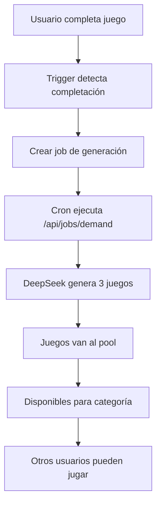

# 🚀 Sistema de Generación por Demanda

## 📋 Resumen

El **Sistema de Generación por Demanda** implementa la lógica de "1 juego completado = 3 juegos generados" que se comparten entre usuarios de la misma categoría educativa.

## 🎯 Objetivos

- ✅ **Generación reactiva**: Crear 3 juegos cuando un usuario completa 1
- ✅ **Compartir por categoría**: Juegos disponibles para usuarios del mismo nivel
- ✅ **Personalización**: Juegos adaptados a las preferencias del usuario
- ✅ **Escalabilidad**: Sistema que crece con el uso
- ✅ **Eficiencia**: Generación solo cuando es necesaria

## 🏗️ Arquitectura

### Base de Datos

```sql
-- Preferencias de usuario por categoría
user_game_preferences (
  user_id, user_category, preferred_subjects, preferred_grades,
  total_games_played, last_played_at
)

-- Tracking de uso de juegos del pool
pool_game_usage (
  game_id, user_id, user_category, score, time_spent, completed
)

-- Jobs de generación por demanda
demand_generation_jobs (
  triggered_by_user_id, user_category, preferred_subjects,
  target_count, status, generated_games
)
```

### Flujo de Trabajo



## 🔧 Componentes

### 1. Migración de Base de Datos

**Archivo**: `supabase/migrations/008_demand_generation_system.sql`

- Crea tablas para tracking y preferencias
- Implementa triggers automáticos
- Define funciones de generación
- Configura RLS y políticas

### 2. API Endpoints

#### `/api/jobs/demand` (POST)
- Procesa jobs de generación por demanda
- Llama a DeepSeek para crear juegos
- Actualiza estadísticas

#### `/api/pool/usage` (POST/PUT/GET)
- Registra uso de juegos
- Actualiza progreso
- Obtiene estadísticas

#### `/api/pool/category` (GET/POST)
- Obtiene juegos por categoría
- Personaliza por preferencias
- Maneja rotación de juegos

### 3. Hooks y Componentes

#### `useDemandGeneration`
- Hook personalizado para manejar generación por demanda
- Funciones para tracking y preferencias
- Estado reactivo de juegos

#### `DemandGenerationStats`
- Componente para mostrar estadísticas
- Monitoreo de jobs y generación
- Información del sistema

### 4. Scripts y Automatización

#### `scripts/run-demand-generation.js`
- Script para ejecutar jobs manualmente
- Procesamiento en lote
- Logging detallado

#### `scripts/test-demand-generation.sh`
- Script de pruebas
- Simulación de usuarios
- Verificación de funcionalidad

## ⚙️ Configuración

### Variables de Entorno

```env
# DeepSeek API
DEEPSEEK_API_KEY=your_api_key
DEEPSEEK_BASE_URL=https://api.deepseek.com
DEEPSEEK_MODEL=deepseek-chat

# Supabase
NEXT_PUBLIC_SUPABASE_URL=your_supabase_url
SUPABASE_SERVICE_KEY=your_service_key

# App
NEXT_PUBLIC_APP_URL=https://your-app.vercel.app
```

### Cron Jobs (Vercel)

```json
{
  "crons": [
    {
      "path": "/api/jobs/run",
      "schedule": "*/5 * * * *"
    },
    {
      "path": "/api/jobs/demand", 
      "schedule": "*/3 * * * *"
    }
  ]
}
```

## 🚀 Uso

### 1. Aplicar Migración

```bash
# Ejecutar migración
supabase db push

# O aplicar manualmente
psql -f supabase/migrations/008_demand_generation_system.sql
```

### 2. Configurar Cron Jobs

```bash
# En Vercel, los cron jobs se configuran automáticamente
# Verificar en el dashboard de Vercel
```

### 3. Probar el Sistema

```bash
# Ejecutar script de prueba
./scripts/test-demand-generation.sh

# O ejecutar manualmente
node scripts/run-demand-generation.js
```

### 4. Monitorear

```typescript
// Usar el hook en componentes
const { games, stats, trackGameUsage } = useDemandGeneration(userId);

// Registrar uso de juego
await trackGameUsage(gameId, score, timeSpent, true);
```

## 📊 Monitoreo

### Estadísticas Disponibles

- **Total Jobs**: Número total de jobs de generación
- **Completados**: Jobs procesados exitosamente
- **Fallidos**: Jobs con errores
- **Juegos Generados**: Total de juegos creados
- **Tasa de Éxito**: Porcentaje de jobs exitosos

### Logs Importantes

```bash
# Ver logs de generación
curl -X GET "https://your-app.vercel.app/api/jobs/demand"

# Ver estadísticas de uso
curl -X GET "https://your-app.vercel.app/api/pool/usage?user_id=USER_ID"
```

## 🔍 Troubleshooting

### Problemas Comunes

1. **Jobs no se procesan**
   - Verificar cron jobs en Vercel
   - Revisar logs de `/api/jobs/demand`
   - Confirmar que DeepSeek API funciona

2. **Juegos no se generan**
   - Verificar triggers en base de datos
   - Confirmar que `pool_game_usage` se actualiza
   - Revisar logs de DeepSeek

3. **Juegos no aparecen**
   - Verificar que `status = 'ready'`
   - Confirmar categoría de usuario
   - Revisar políticas RLS

### Comandos de Diagnóstico

```sql
-- Verificar jobs pendientes
SELECT * FROM demand_generation_jobs WHERE status = 'pending';

-- Verificar uso de juegos
SELECT * FROM pool_game_usage WHERE completed = true;

-- Verificar juegos generados
SELECT * FROM games_pool WHERE source = 'ai' ORDER BY created_at DESC;
```

## 🎯 Beneficios

1. **Escalabilidad**: El sistema crece automáticamente con el uso
2. **Personalización**: Juegos adaptados a cada usuario
3. **Compartir**: Contenido disponible para toda la categoría
4. **Eficiencia**: Generación solo cuando es necesaria
5. **Frescura**: Contenido siempre nuevo y relevante

## 🔮 Futuras Mejoras

- **Machine Learning**: Mejorar recomendaciones basadas en uso
- **Analytics Avanzados**: Métricas detalladas de engagement
- **Colaboración**: Juegos generados por múltiples usuarios
- **A/B Testing**: Probar diferentes tipos de generación
- **Caching Inteligente**: Optimizar rendimiento de generación
