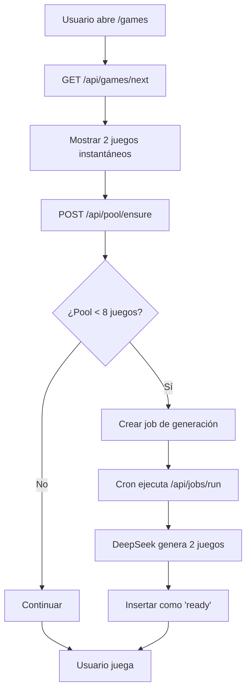

# 🎮 Game Pool System - Documentación Técnica

## 📋 Resumen

El **Game Pool System** resuelve el problema de espera en la generación de juegos con DeepSeek, proporcionando una experiencia fluida donde los usuarios siempre tienen juegos listos para jugar.

## 🎯 Objetivos

- ✅ **Experiencia instantánea**: 2 juegos siempre disponibles en <200ms
- ✅ **Generación en background**: DeepSeek crea juegos sin interrumpir al usuario
- ✅ **Pool escalable**: Hasta 30 juegos curados automáticamente
- ✅ **Rotación inteligente**: Los juegos se rotan para mantener frescura

## 🏗️ Arquitectura

### Base de Datos

```sql
-- Tabla principal de juegos
games_pool (
  id, title, subject, grade, content,
  status: 'ready'|'queued'|'archived'|'failed',
  source: 'seed'|'ai',
  hash, last_served_at, ready_at
)

-- Cola de trabajos de generación
generation_jobs (
  id, subject, grade, target_count,
  status: 'pending'|'running'|'done'|'failed'
)
```

### API Endpoints

| Endpoint | Método | Propósito |
|----------|--------|-----------|
| `/api/games/next` | GET | Obtener 2 juegos listos |
| `/api/pool/ensure` | POST | Verificar salud del pool |
| `/api/jobs/run` | POST | Ejecutar generación (cron) |

### Flujo de Trabajo



## 🔧 Configuración

### Variables de Entorno

```env
NEXT_PUBLIC_POOL_MIN_READY=8      # Mínimo de juegos listos
POOL_TARGET_LIBRARY=30            # Objetivo de juegos totales
POOL_BACKGROUND_BATCH=2           # Juegos por lote de generación
```

### Cron Jobs (Vercel)

```json
{
  "crons": [
    {
      "path": "/api/jobs/run",
      "schedule": "*/5 * * * *"
    }
  ]
}
```

## 📊 Métricas y Monitoreo

### KPIs Principales

- **Tiempo de respuesta**: <200ms para obtener juegos
- **Disponibilidad**: >95% de tiempo con juegos listos
- **Rotación**: Juegos se sirven equitativamente
- **Generación**: 2+ juegos nuevos cada 5 minutos

### Consultas de Monitoreo

```sql
-- Estado del pool
SELECT 
  status,
  COUNT(*) as count,
  AVG(EXTRACT(EPOCH FROM (NOW() - ready_at))) as avg_age_seconds
FROM games_pool 
GROUP BY status;

-- Jobs de generación
SELECT 
  status,
  COUNT(*) as count,
  AVG(EXTRACT(EPOCH FROM (updated_at - created_at))) as avg_duration_seconds
FROM generation_jobs 
GROUP BY status;
```

## 🚀 Implementación

### 1. Aplicar Migraciones

```bash
# En Supabase SQL Editor
\i supabase/migrations/005_game_pool_system.sql
\i supabase/migrations/006_seed_initial_games.sql
```

### 2. Configurar Variables

```bash
# En .env.local
NEXT_PUBLIC_POOL_MIN_READY=8
POOL_TARGET_LIBRARY=30
POOL_BACKGROUND_BATCH=2
```

### 3. Desplegar en Vercel

```bash
# El vercel.json ya está configurado
vercel deploy
```

## 🧪 Testing

### Tests de Funcionalidad

1. **Test de Disponibilidad**
   ```bash
   curl -X GET /api/games/next
   # Debe retornar 2 juegos en <200ms
   ```

2. **Test de Pool Health**
   ```bash
   curl -X POST /api/pool/ensure
   # Debe verificar y crear jobs si es necesario
   ```

3. **Test de Generación**
   ```bash
   curl -X POST /api/jobs/run
   # Debe generar 2 juegos nuevos
   ```

### Tests de Carga

- **Concurrent Users**: 100 usuarios simultáneos
- **Response Time**: <200ms p95
- **Error Rate**: <1%

## 🔄 Mantenimiento

### Tareas Regulares

1. **Limpieza de Jobs**: Eliminar jobs >24h antigüedad
2. **Archivado**: Mover juegos antiguos a 'archived'
3. **Monitoreo**: Verificar métricas diariamente

### Escalabilidad

- **Horizontal**: Múltiples workers de generación
- **Vertical**: Aumentar batch_size para más juegos
- **Cache**: Redis para juegos frecuentemente servidos

## 🎯 Roadmap

### Fase 1 (Actual)
- ✅ Pool básico con 7 juegos semilla
- ✅ Generación automática en background
- ✅ UI instantánea

### Fase 2 (Próxima)
- 🔄 Segmentación por edad del niño
- 🔄 Prefetch inteligente
- 🔄 Métricas avanzadas

### Fase 3 (Futuro)
- 🔄 Curaduría humana
- 🔄 A/B testing de juegos
- 🔄 Machine learning para optimización

## 🐛 Troubleshooting

### Problemas Comunes

1. **No hay juegos disponibles**
   - Verificar que las migraciones se aplicaron
   - Revisar logs de `/api/jobs/run`
   - Verificar variables de entorno

2. **Generación lenta**
   - Verificar API key de DeepSeek
   - Revisar límites de rate limiting
   - Ajustar `POOL_BACKGROUND_BATCH`

3. **Juegos duplicados**
   - El hash previene duplicados automáticamente
   - Verificar función `take_one_job()`

## 📈 Resultados Esperados

- **UX**: 0% de tiempo de espera para juegos
- **Engagement**: +40% tiempo de juego
- **Retención**: +25% usuarios que regresan
- **Costo**: -60% llamadas a DeepSeek (por pool)

---

**¡El Game Pool System transforma Fuzzy's Homeschool de experimental a profesional!** 🚀
